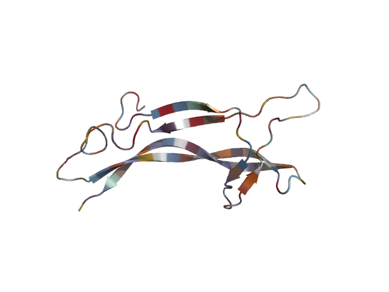
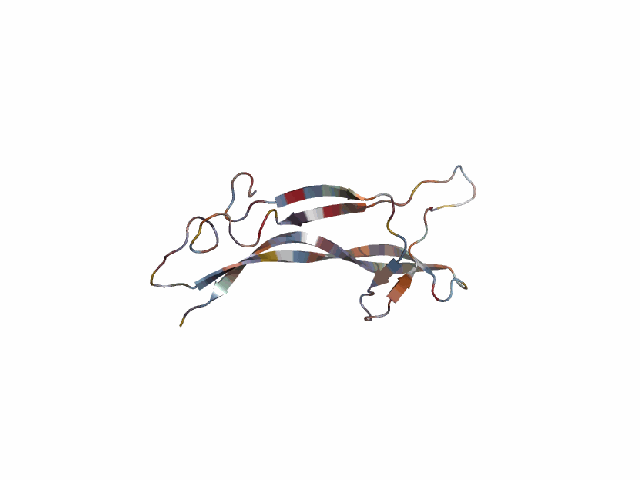
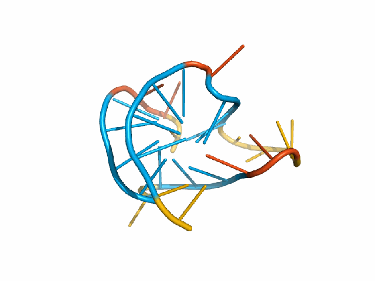
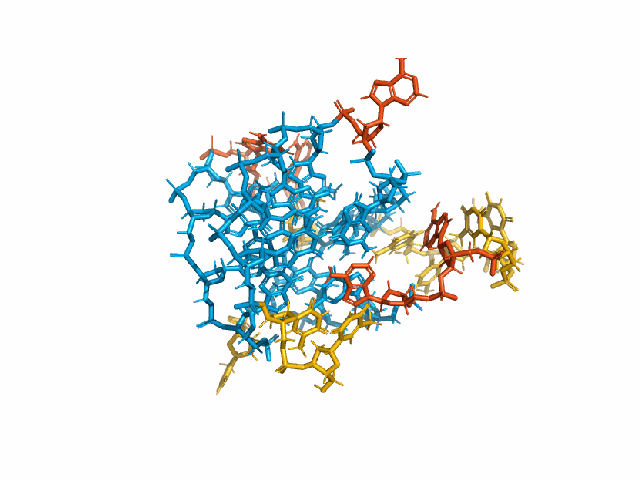
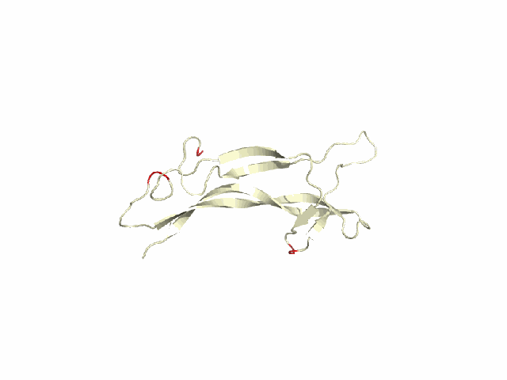
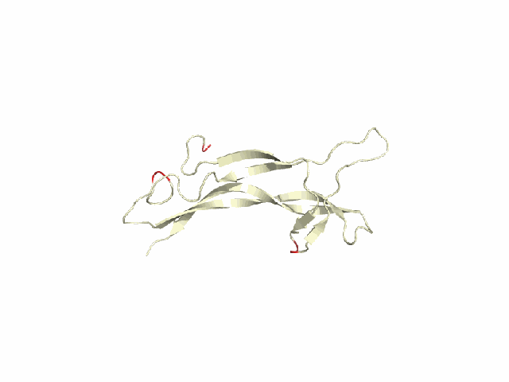
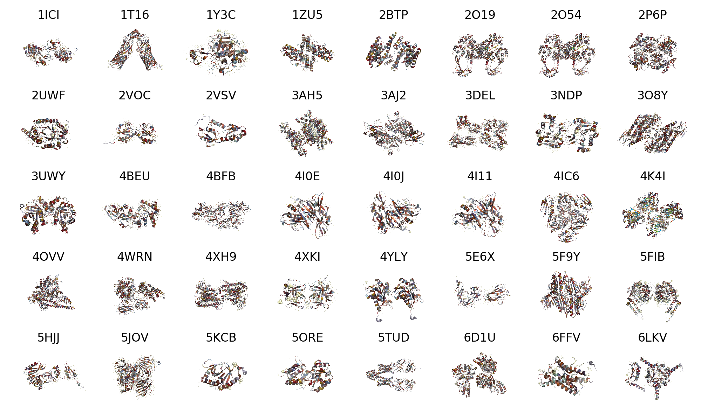
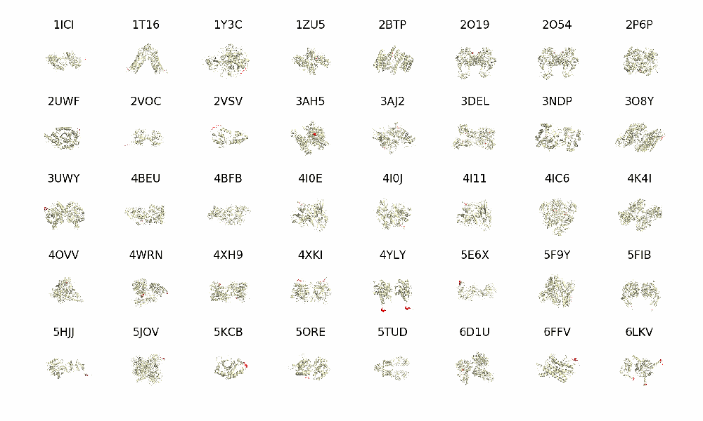

# pymolBE
Customized batch exhibition of three-dimensional molecules based on the pymol framework

## Installation
You can use this tool through [pymolbe.py](https://github.com/HaolingZHANG/pymolBE/blob/main/pymolbe.py).
This tool requires a Python version >=3.7, 
as well as some basic libraries 
[PyMOL 2.5.0](https://pymol.org/2/), [biopython 1.78](https://pypi.org/project/biopython/),
[matplotlib 3.1.1](https://pypi.org/project/matplotlib/), [Pillow 8.2.0](https://pypi.org/project/Pillow/), and
[numpy](https://pypi.org/project/numpy/).


## Repository Structure
The structure of this tool is shown below:
```html
├── examples                // Examples of pymolBE
├── pymolbe.py              // Source code of pymolBE
│    ├── draw_colorfully    // Draw a molecular structure colorfully
│    ├── draw_specially     // Draw a molecular structure with special motifs
│    ├── merge_pictures     // Merge multiple structure pictures into a picture
│    ├── merge_animations   // Merge multiple structure animations into a animation
│    ├── set_initial_state  // Set the initial state of a structure with specific representation
│    ├── set_residue_colors // Set residue color for the structure
│    ├── set_motif_colors   // Set the color of each motif
├── README.md               // Description document of library
```

## Usage & Parameters
Please check each interface annotation for more information.
- [pymolbe.draw_colorfully](https://github.com/HaolingZHANG/pymolBE/blob/main/pymolbe.py#L9)
- [pymolbe.draw_specially](https://github.com/HaolingZHANG/pymolBE/blob/main/pymolbe.py#L58)
- [pymolbe.merge_pictures](https://github.com/HaolingZHANG/pymolBE/blob/main/pymolbe.py#L107)
- [pymolbe.merge_animations](https://github.com/HaolingZHANG/pymolBE/blob/main/pymolbe.py#L152)
- [pymolbe.set_initial_state](https://github.com/HaolingZHANG/pymolBE/blob/main/pymolbe.py#L253)
- [pymolbe.set_residue_colors](https://github.com/HaolingZHANG/pymolBE/blob/main/pymolbe.py#L280)
- [pymolbe.set_motif_colors](https://github.com/HaolingZHANG/pymolBE/blob/main/pymolbe.py#L305)


## Exhibition Examples
These examples are successfully run in [example](https://github.com/HaolingZHANG/examples/) folder.

### Draw a static picture for a PDB file
run the following statements

```python
from pymolbe import draw_colorfully

draw_colorfully(load_path="./data/p.pdb", 
                save_path="./figures/ps_c.png",
                hides=["(r. HOH)"])
```
and obtain

<p align="center">

</p>


### Draw an animation for a PDB file that revolved around the y-axis
run the following statements

```python
from pymolbe import draw_colorfully

draw_colorfully(load_path="./data/p.pdb", 
                save_path="./figures/ps_c.gif",
                hides=["(r. HOH)"], 
                is_movie=True, 
                shafts="y")
```
and obtain

<p align="center">

</p>

### Draw an animation for a mmCIF file that revolved around the y-axis
run the following statements

```python
from pymolbe import draw_colorfully

draw_colorfully(load_path="./data/d.cif", 
                save_path="./figures/ds_c.gif",
                hides=["(r. HOH)"], 
                is_movie=True, 
                shafts="y")
```
and obtain

<p align="center">

</p>


### Draw an animation for a mmCIF file that revolved around the y-axis with sticks format
run the following statements

```python
from pymolbe import draw_colorfully

draw_colorfully(load_path="./data/d.cif", 
                save_path="./figures/ds_s.gif",
                representation="sticks",  
                hides=["(r. HOH)"], 
                is_movie=True, 
                shafts="y")
```

and obtain

<p align="center">

</p>

### Draw an animation for a PDB file that revolved around the y-axis with motif "RG"
run the following statements

```python
from pymolbe import draw_specially

draw_specially(load_path="./data/p.pdb", 
               save_path="./figures/ps_s.gif", 
               motif_colors={"RG": "0xff0000"},
               hides=["(r. HOH)"], 
               is_movie=True, 
               shafts="y")
```

and obtain

<p align="center">

</p>

### Draw an animation for a PDB file that revolved around the xyz-axis with motif "RG"
run the following statements

```python
from pymolbe import draw_specially

draw_specially(load_path="./data/p.pdb", 
               save_path="./figures/ps_xyz.gif", 
               motif_colors={"RG": "0xff0000"},
               hides=["(r. HOH)"], 
               is_movie=True, 
               shafts="xyz")
```

and obtain

<p align="center">

</p>

### Draw a merged picture for 40 PDB files that contain motif "HHHHH"
run the following statements

```python
from os import listdir, remove
from pymolbe import draw_colorfully, merge_pictures

temp_paths, titles = [], []
for index, child_path in enumerate(listdir("./data/m/")):
    temp_path = "./figures/temp" + str(index + 1).zfill(2) + ".png"
    draw_colorfully(load_path="./data/m/" + child_path, 
                    save_path=temp_path)
    titles.append(child_path[:4])
    temp_paths.append(temp_path)

merge_pictures(load_paths=temp_paths, 
               save_path="./figures/m_p.png", 
               row_number=5, 
               column_number=8,
               figure_size=(10, 6), 
               titles=titles)

for used_path in temp_paths:
    remove(used_path)
```

and obtain

<p align="center">

</p>

### Draw a merged animation for 40 PDB files simultaneously that contain motif "HHHHH" (emphasizing the location of motif)
run the following statements

```python
from os import listdir, remove
from pymolbe import draw_specially, merge_animations

temp_paths, titles = [], []
for index, child_path in enumerate(listdir("./data/m/")):
    temp_path = "./figures/temp" + str(index + 1).zfill(2) + ".gif"
    draw_specially(load_path="./data/m/" + child_path, 
                   save_path=temp_path, 
                   motif_colors={"HHHHH": "0xff0000"},
                   is_movie=True, 
                   shafts="y")
    titles.append(child_path[:4])
    temp_paths.append(temp_path)

merge_animations(load_paths=temp_paths, 
                 save_path="./figures/m_ps.gif", 
                 row_number=5, 
                 column_number=8,
                 figure_size=(10, 6), 
                 titles=titles, 
                 simultaneous=True)

for used_path in temp_paths:
    remove(used_path)
```

and obtain

<p align="center">

</p>


### Draw a merged animation for 40 PDB files case-by-case that contain motif "HHHHH" (emphasizing the location of motif)
run the following statements

```python
from os import listdir, remove
from pymolbe import draw_specially, merge_animations

temp_paths, titles = [], []
for index, child_path in enumerate(listdir("./data/m/")):
    temp_path = "./figures/temp" + str(index + 1).zfill(2) + ".gif"
    draw_specially(load_path="./data/m/" + child_path, 
                   save_path=temp_path, 
                   motif_colors={"HHHHH": "0xff0000"},
                   is_movie=True, 
                   shafts="y")
    titles.append(child_path[:4])
    temp_paths.append(temp_path)

merge_animations(load_paths=temp_paths, 
                 save_path="./figures/m_pi.gif", 
                 figure_size=(10, 6), 
                 titles=titles, 
                 simultaneous=False,
                 fps=20)

for used_path in temp_paths:
    remove(used_path)
```

and obtain

<p align="center">

</p>
